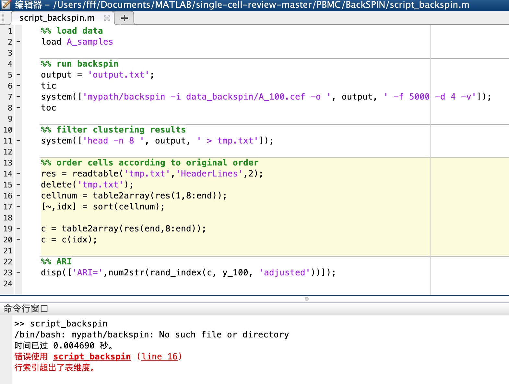
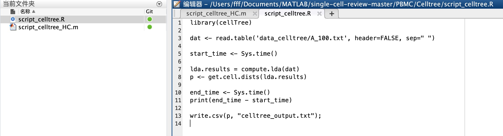
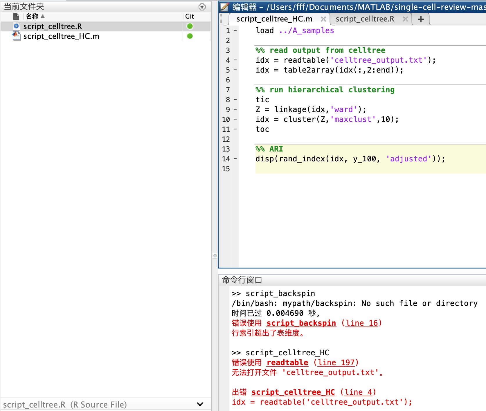

# 9/25报告

## 文献：Machine learning and statistical methods for clustering single-cell RNA-sequencing data

### 已完成的任务：
1. 翻译并阅读了整片论文。了解了各种聚类方法；了解了对数据的预处理方法，例如PCA降维,Z-score去量纲；

### 遇到的问题
1. 程序除了k-means，运行都出现了问题，不太清楚程序的运行流程。.m文件，.R文件分别怎么运行和运行先后顺序不太清楚。

- backspin算法只包含一个.m文件，如上图中，第7行system不太理解，使用matlab打开，运行出错。不知道是怎么调用backspin算法的。
&nbsp
&nbsp

- cellTree算法包含.m和.R文件。其中.R文件第一行library(cellTree)，这个package在r编译器里导入不进去。
.m文件直接读取celltree_output.txt文件，应该是.R文件生成的，现在R不会运行，所以也不成功。
2. 集成聚类的资料百度不到，不太理解原理
3. 老师提问，每一个人身上的dna、rna不是都是一样的嘛，为啥会有不一样的基因测序。这样涉及生物的问题，我自己也没太明白。
